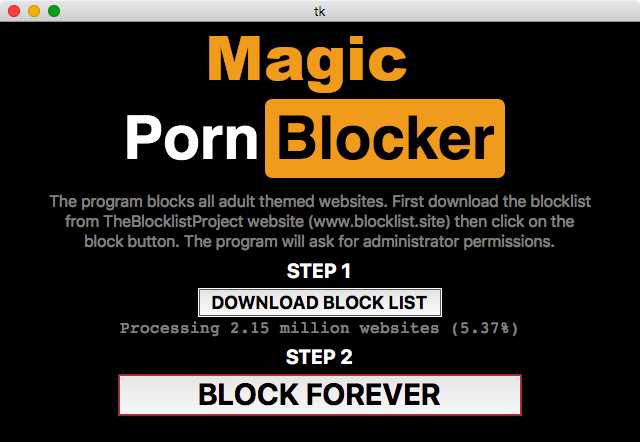
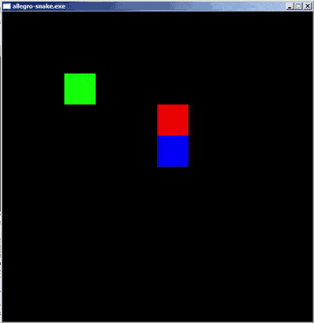

This is a collection of my small programs that do not deserve a separate repository one by one.

[Image aspect ratio cropper (Python OpenCV)](image-aspect-ratio-cropper)
-------------------

This batch tool crops JPG images in the current folder to a desired aspect ratio. You can select the cropping area with your mouse.

[Image organizer (Python)](image-organizer)
-------------------

Use your keyboard to assort images into folders.

[Sudoku Solver (PHP)](sudoku-solver)
-------------------

Sudoku Solver in PHP. It uses the [backtrack](https://en.wikipedia.org/wiki/Sudoku_solving_algorithms#Backtracking) (non recursive) algoritm to solve 9x9 sudokus.

[ASCII Sokoban (C)](ascii-sokoban)
-----------------

Sokoban game written in C without any graphic library. Only 100 lines of code.

[Image noise remover (Python OpenCV)](image-noise-remover)
-----------------

This tool removes the noise from low-light images with image stacking.

[Magic Porn Blocker (Python)](magic-porn-blocker)
-----------------

Blocks every adult themed websites.

[Single file PHP blog (PHP)](single-file-php-blog)
-----------------

The simplest single file PHP blog. Only 75 lines of code!

[FFMPEG MP4 Command generator (HTML JS)](ffmpeg-command-generator)
-----------------

This tool helps you to easily generate FFmpeg commands to convert MP4 video files. Just select the settings by filling out a form, and copy the generated command. 

[Snake (C, Allegro Game Engine)](snake)
-----------------

Simple Snake game. Only 100 lines of code.

[Folder accent remover (C#)](folder-accent-remover)
-----------------

Removes the accents from directory names.

