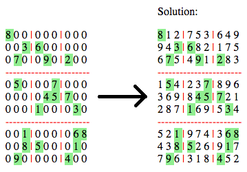
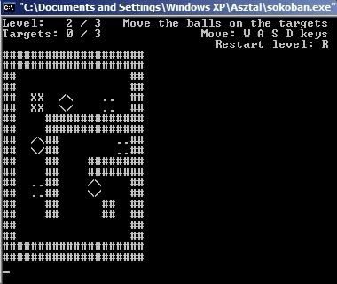

This is a collection of my small programs that do not deserve a separate repository one by one.

[Sudoku Solver (PHP)](sudoku-solver)
-------------------

Sudoku Solver in PHP. It uses the [backtrack](https://en.wikipedia.org/wiki/Sudoku_solving_algorithms#Backtracking) (non recursive) algoritm to solve 9x9 sudokus.

[ASCII Sokoban (C)](ascii-sokoban)
-----------------

Sokoban game written in C without any graphic library. Only 100 lines of code.

