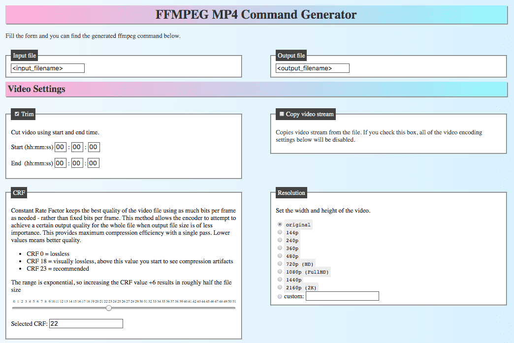

FFMPEG MP4 Command Generator
----------------------------

This tool helps you to easily generate FFmpeg commands to convert MP4 video files. Just select the settings by filling out a form, and copy the generated command. 

Visit: [https://hlorand.github.io/small-programs/ffmpeg-command-generator/](https://hlorand.github.io/small-programs/ffmpeg-command-generator/)

