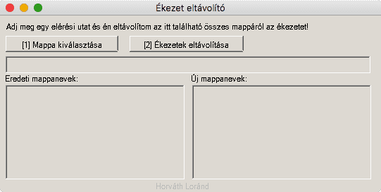

Folder accent remover
----------------------------

This tool removes the accents from the charactes from folder names. Example:

```
c:\dir\Árvíztűrő
c:\dir\tükörfúrógép

 |         |
 V becomes V

c:\dir\Arvizturo
c:\dir\tukorfurogep
```



