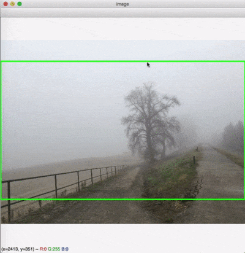

Image Aspect Ratio Cropper
----------------------------

This batch tool crops JPG images in the *current folder* to a desired aspect ratio. You can select the cropping area with your mouse.

Usage:

```
python3 image-aspect-ratio-cropper.py
```



Keyboard shortcuts:
- `1` : Set 16:9 aspect ratio
- `2` : Set 4:3 aspect ratio
- `3` : Set 3:2 aspect ratio
- `n` : Skip to next image
- `s` : Switch aspects (ex. 16:9 -> 9:16) TODO: not working
- `mouse click` or `c` or `space` : Crop image
- `q` : Quit

