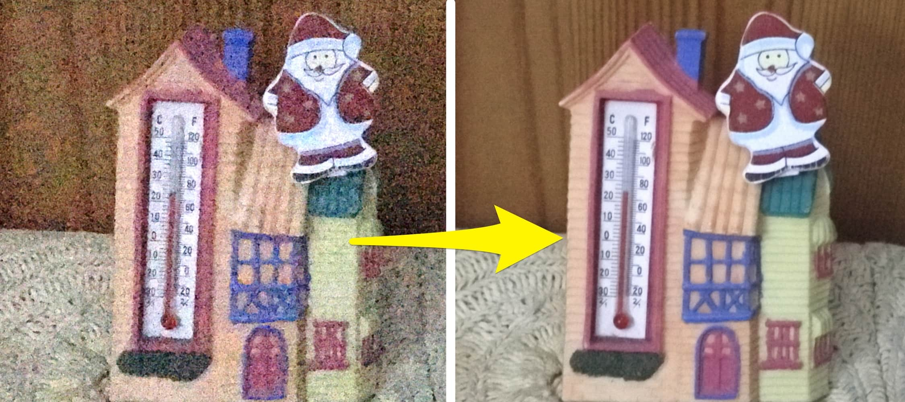

Image sequence noise remover
----------------------------

This tool removes the noise from low-light images with image stacking. You need *multiple images*: you need an image sequence shot from a tripod, from the same position. The program merges the images, filtering out the noise.

Usage: 

```
python3 image-noise-remover.py  input_folder_with_images/  output.jpg
```



[image-noise-remover.py](image-noise-remover.py)

