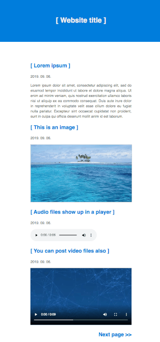

Single file PHP blog
--------------------

The simplest single file PHP blog. Only 75 lines of code!

### Usage

Place your blog content inside `/posts` folder. 

- Post title is the filename.
- Posts ordered by file modification date.
- You can change the settings in the source code in the config section: *blog title, color scheme, posts folder, date format, posts per page setting, button labels*

System requirements: `PHP 7.0+`

### Supports

- text files (`txt`)
- HTML files (`htm`)
- images (`jpg`, `png`, `gif`, `webp`)
- video files (`mp4`, `avi`, `mpg`, `webm`)
- audio files (`mp3`, `ogg`, `wav`)
- pdf documents (`pdf`)
- other file formats will be linked

### Screenshot

