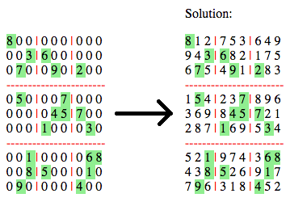

Sudoku Solver (PHP)
-------------------

Sudoku Solver in PHP. It uses the [backtrack](https://en.wikipedia.org/wiki/Sudoku_solving_algorithms#Backtracking) (non recursive) algoritm to solve 9x9 sudokus.

[sudoku-solver.php](sudoku-solver.php)